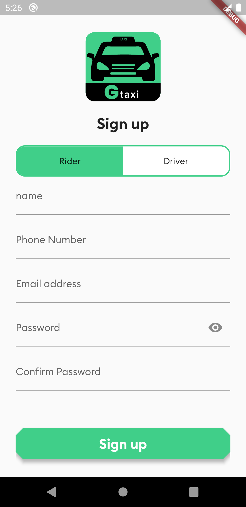
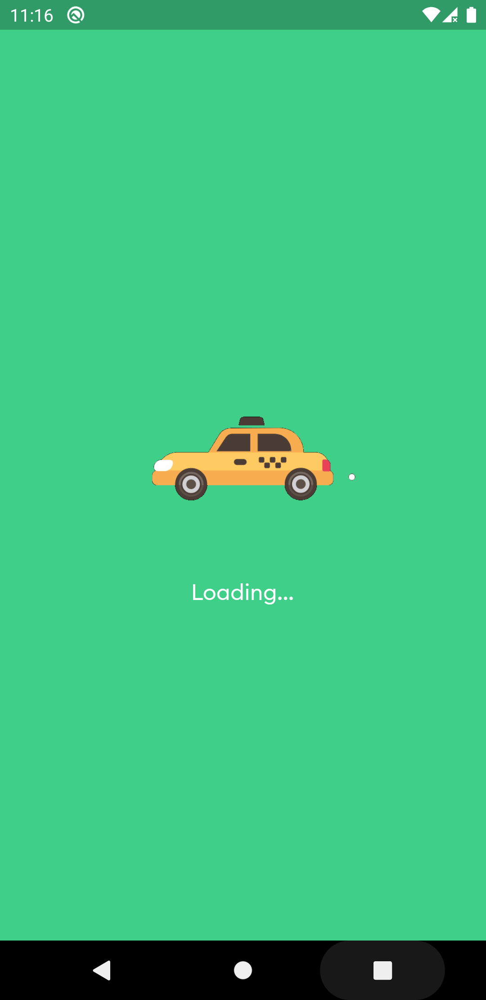
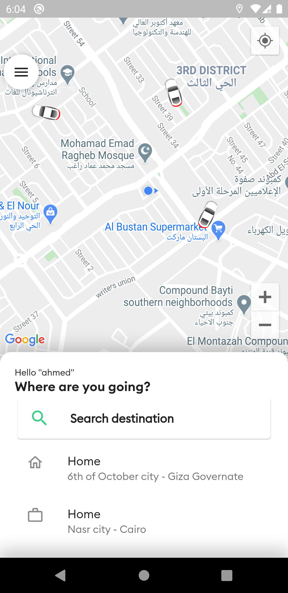
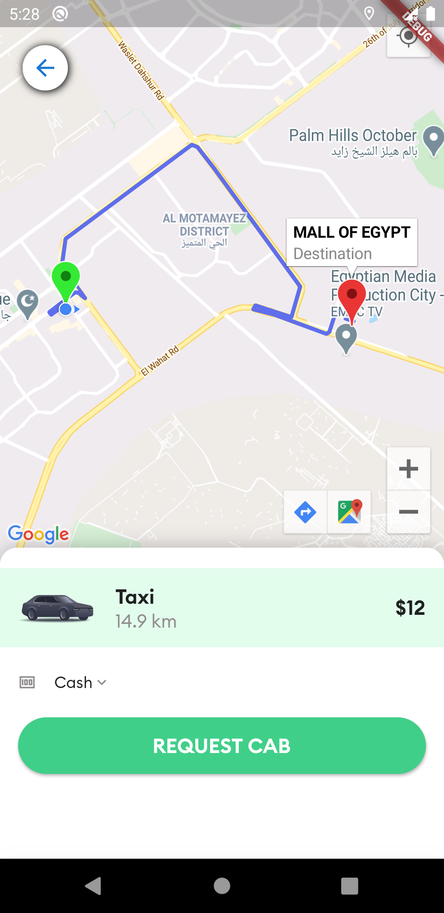
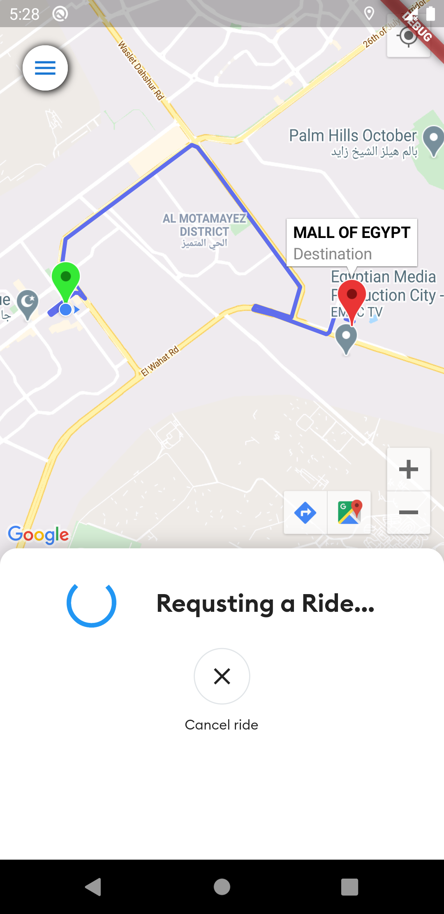
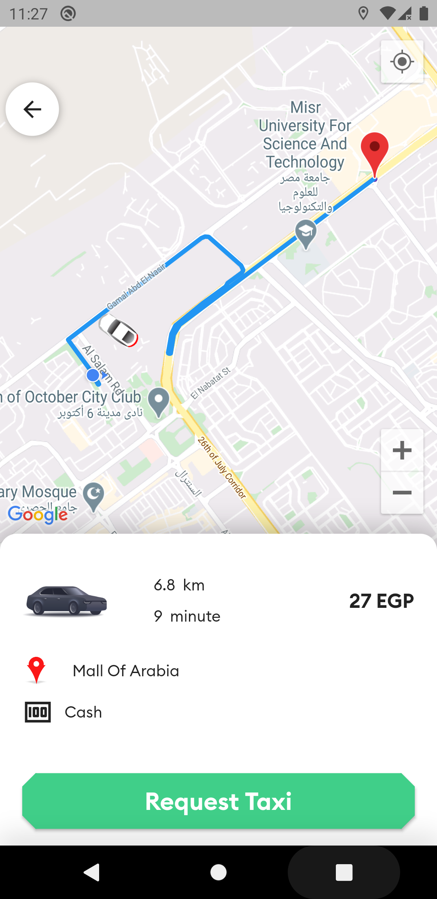
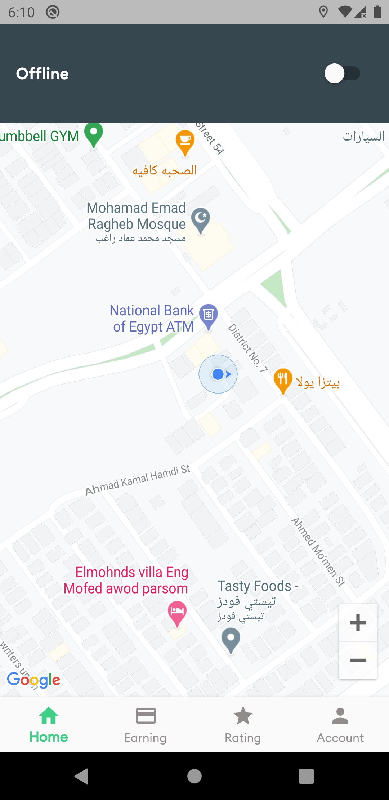
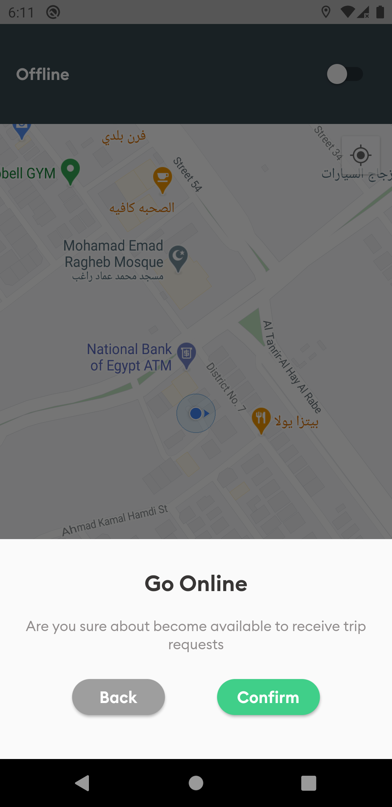
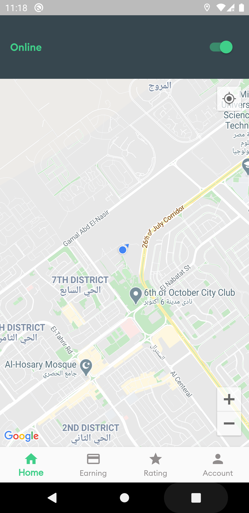

# My Green Taxi 🚕

Flutter Taxi App (for passenger and driver ) communicates with the Google Maps API Directions Service which receives direction requests and returns an efficient path. The application works on Android  iOS.

- Show current location on map.
- Get polyline path between location and destination on the map.
- Search destination place by name (place ID).
- Calculate distance, cost, time of the trip.
- Responsive Design.

## Screenshots

